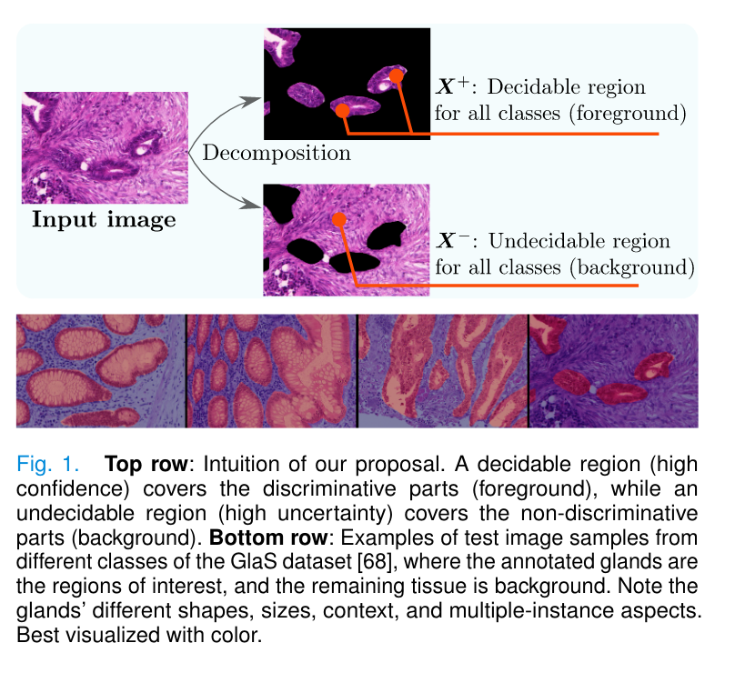
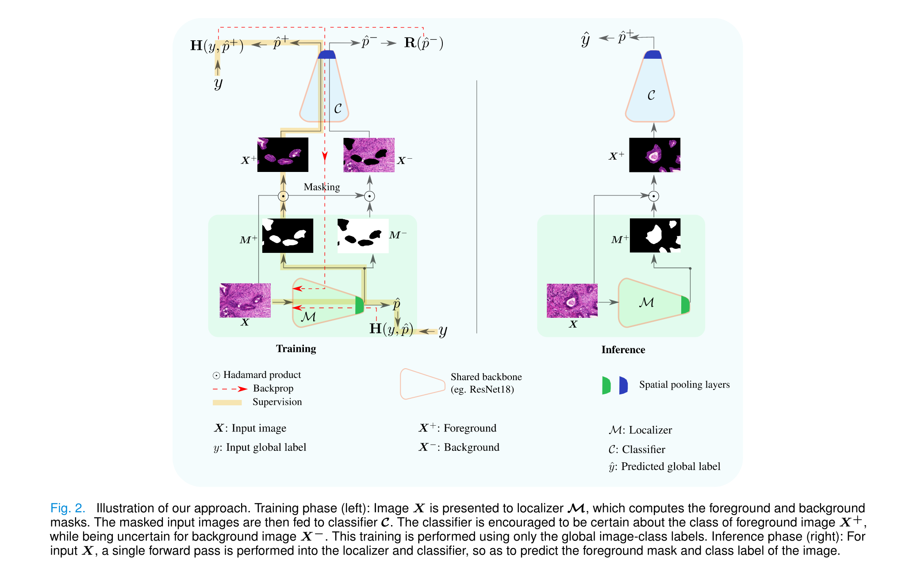
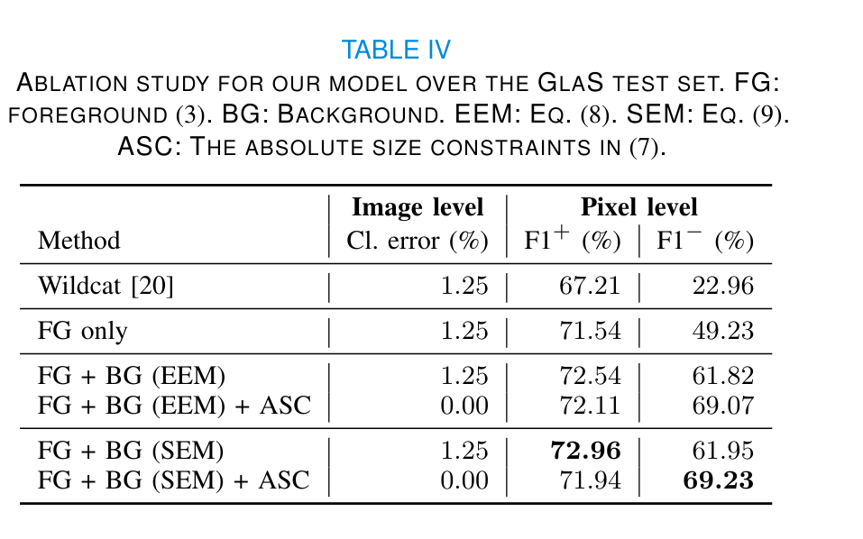
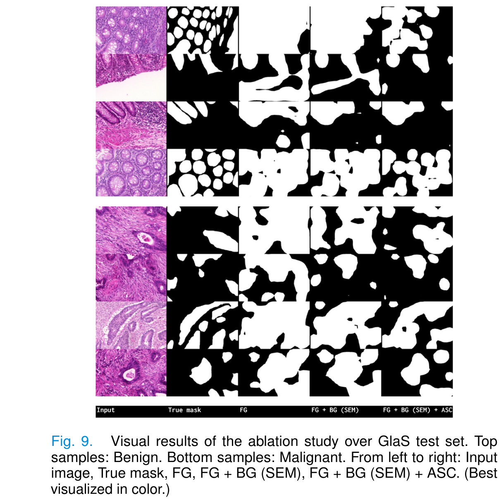
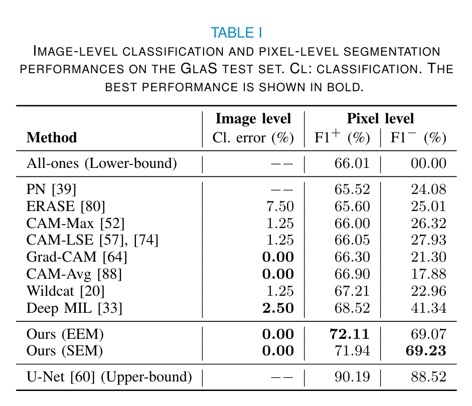
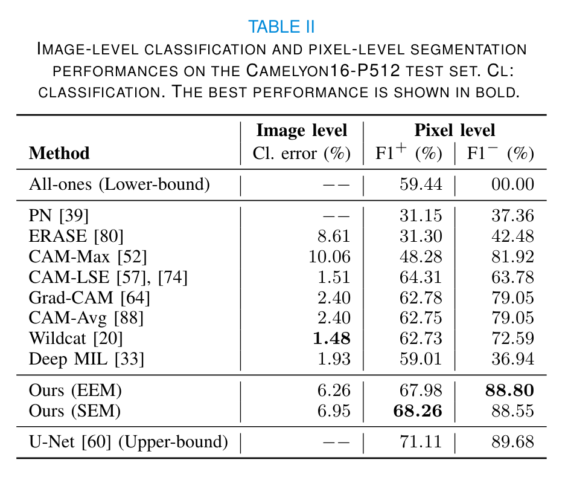
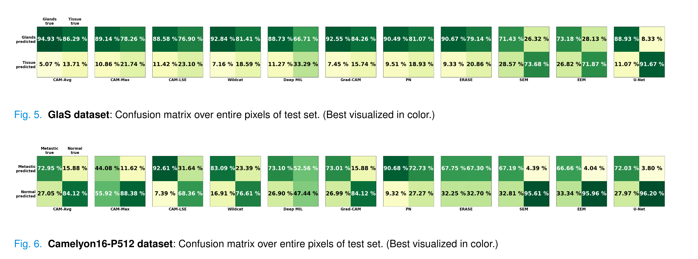
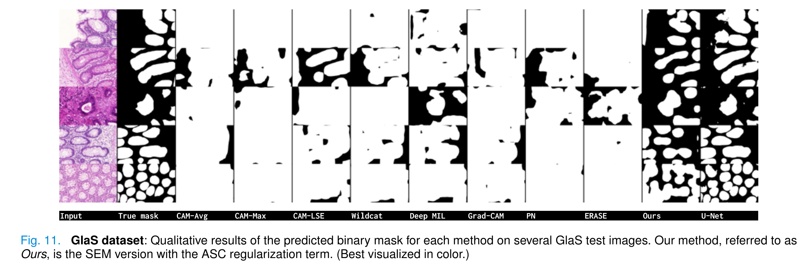
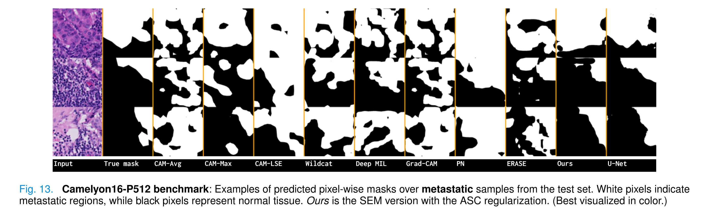
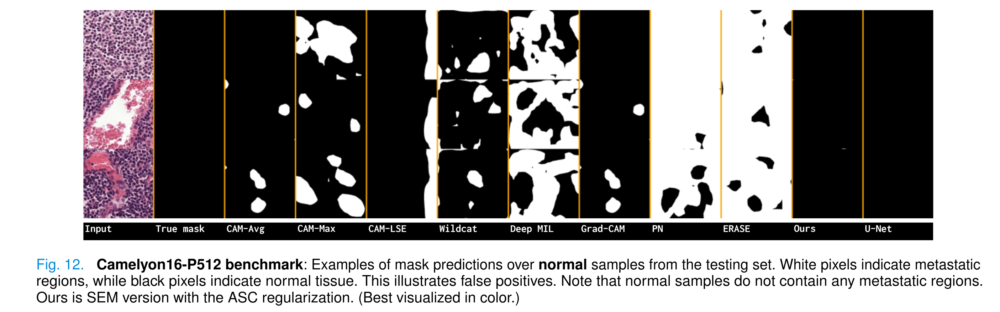

### Pytorch code for:

`Deep Interpretable Classification and Weakly-Supervised Segmentation of Histology Images via Max-Min Uncertainty`

 [(arxiv.org/abs/2011.07221)](https://arxiv.org/abs/2011.07221)

### Citation:
```
@article{belharbi2020minmaxuncer,
  title={Deep Interpretable Classification and Weakly-Supervised Segmentation of Histology Images via Max-Min Uncertainty},
  author={Belharbi, S. and Rony, J. and Dolz, J. and Ben Ayed, I. and McCaffrey, L. and Granger, E.},
  journal={IEEE Transactions on Medical Imaging},
  year={2021}
}
```

### Content:
1. [Method overview](#methodOverview)
2. [Datasets](#datasets)
3. [Requirements](#requirements)
4. [How to run the code](#runCode)
5. [Reproducibility](#reproducibility)
6. [MultiGPU support and reproducibility](#multigpuSupport)
7. [Synchronized-Batch-Norm support (MultiGPUs)](#synchBNSupportMultigpu)


### 1. <a name="methodOverview"></a> Method overview:

* Method:





* Ablation studies:





* Results (Quantitative):








* Results (Qualitative):








### 2. <a name="datasets"></a> Datasets:

#### 2.1. Links to dataset:
* [GlaS](https://warwick.ac.uk/fac/sci/dcs/research/tia/glascontest)
* [Camelyon16](https://github.com/jeromerony/survey_wsl_histology)


#### 2.2. Download datasets:

* GlaS: [./download-glas-dataset.sh](./download-glas-dataset.sh).

You find the splits in [./folds](./folds). The code that generated the splits
 is [./create_folds.py](./create_folds.py).


### 3. <a name="requirements"></a> Requirements:
We use [torch_nightly-1.2.0.dev20190616](https://pytorch.org/) and [Python 3.7.0](https://www.python.org). For installation, see [
./dependencies](
./dependencies) for a way on how to install the requirements within a virtual environment.

Installing some packages manually:
* Pytorch: `pip install https://download.pytorch.org/whl/nightly/cu100/torch_nightly-1.2.0.dev20190616-cp37-cp37m-linux_x86_64.whl`
* Torchvision: `pip install torchvision==0.2.2.post3`
* SPAMS:
    * `wget http://spams-devel.gforge.inria.fr/hitcounter2.php?file=file/37660/spams-python.anaconda-v2.6.1-2018-08-06.tar.gz`
    * `$ tar -xf 'hitcounter2.php?file=file%2F37660%2Fspams-python.anaconda-v2.6.1-2018-08-06.tar.gz'`
    * `$ cd spams-2.6.1/`
    * `$ python setup.py install`
* PyDenseCRF for CRF post-processing (commit: `4d5343c398d75d7ebae34f51a47769084ba3a613`): `pip install
git+https://github.com/lucasb-eyer/pydensecrf.git@4d5343c398d75d7ebae34f51a47769084ba3a613`


### 4. <a name="runCode"></a> How to run the code:
```bash
python main.py --cudaid your_cuda_id --yaml basename_your_yaml_file
```
You can override the values of the yaml file using command line:
```bash
export MYSEED=0
time python main.py --yaml glas.yaml --name sgd --batch_size 4 \
--valid_batch_size 1 --lr 0.001 --weight_decay 0.0001 --momentum 0.9 \
--nesterov True --max_epochs 80 --lr_scheduler_name mystep \
--use_lr_scheduler True --step_size 10 --gamma 0.9 --min_lr 1e-07 \
--model_name resnet18 --scale_in_cl .8 --pretrained True --alpha 0.6 --kmax \
0.3 --kmin 0.0 --dropout 0.1 --modalities 5  --sigma 0.15 --w \
5.0 --crop_size 416 --up_scale_small_dim_to 432 --padding_size 0.01 \
--pad_eval True --cudaid 1  --dataset glas --split 0 --fold 0 \
--debug_subfolder paper-tmi-n-v/glas  --final_thres 0.5 --use_reg True \
--reg_loss KLUniformLoss --use_size_const True --init_t 5.0 --max_t 10.0 \
--mulcoef 1.01 --normalize_sz False --epsilon 0.0 --lambda_neg 1e-7 \
--delta_sigma 0.001 --max_sigma 0.2
# ==============================================================================
```
- GlaS:

```bash
export MYSEED=0
time python main.py --yaml glas.yaml --name sgd --batch_size 4 \
--valid_batch_size 1 --lr 0.001 --weight_decay 0.0001 --momentum 0.9 \
--nesterov True --max_epochs 80 --lr_scheduler_name mystep --use_lr_scheduler \
True --step_size 10 --gamma 0.9 --min_lr 1e-07 --model_name resnet18 \
--scale_in_cl 0.8 --pretrained True --alpha 0.6 --kmax 0.3 --kmin 0.0 \
--dropout 0.1 --modalities 5 --crop_size 416 --up_scale_small_dim_to 432 \
--padding_size 0.0 --pad_eval False --cudaid $cudaid  --dataset glas --split \
0 --fold 0  --debug_subfolder paper-tmi-n-v/glas  --final_thres 0.5 --use_reg \
True --reg_loss KLUniformLoss --lambda_neg 1e-07 --use_size_const True \
--init_t 5.0 --max_t 10.0 --mulcoef 1.01 --normalize_sz False --epsilon 0.0 \
--sigma 0.15 --delta_sigma 0.001 --max_sigma 0.2 --w 5.0 \
--set_normal_cam_zero False --side_cl False
# ==============================================================================

export MYSEED=0
time python main.py --yaml glas.yaml --name sgd --batch_size 4 \
--valid_batch_size 1 --lr 0.001 --weight_decay 0.0001 --momentum 0.9 \
--nesterov True --max_epochs 80 --lr_scheduler_name mystep --use_lr_scheduler \
True --step_size 10 --gamma 0.9 --min_lr 1e-07 --model_name resnet18 \
--scale_in_cl 0.8 --pretrained True --alpha 0.6 --kmax 0.3 --kmin 0.0 \
--dropout 0.1 --modalities 5 --crop_size 416 --up_scale_small_dim_to 432 \
--padding_size 0.0 --pad_eval False --cudaid $cudaid  --dataset glas --split \
0 --fold 0  --debug_subfolder paper-tmi-n-v/glas  --final_thres 0.5 --use_reg \
True --reg_loss NegativeEntropy --lambda_neg 1e-07 --use_size_const True \
--init_t 5.0 --max_t 10.0 --mulcoef 1.01 --normalize_sz False --epsilon 0.0 \
--sigma 0.15 --delta_sigma 0.001 --max_sigma 0.2 --w 5.0 \
--set_normal_cam_zero False --side_cl False
# ==============================================================================

```
- Camelyon16:

```bash
export MYSEED=0
time python main.py --yaml camelyon16-512-patch.yaml --name sgd --batch_size \
4 --valid_batch_size 1 --lr 0.001 --weight_decay 0.0001 --momentum 0.9 \
--nesterov True --max_epochs 20 --lr_scheduler_name mystep --use_lr_scheduler \
True --step_size 10 --gamma 0.9 --min_lr 1e-07 --model_name resnet18 \
--scale_in_cl 0.8 --pretrained True --alpha 0.6 --kmax 0.3 --kmin 0.0 \
--dropout 0.1 --modalities 5 --crop_size 416 --cudaid $cudaid  --dataset \
camelyon16-512-patch --split 0 --fold 0  --debug_subfolder \
paper-tmi-n-v/camelyon16-512-patch  --final_thres 0.5 --use_reg True \
--reg_loss KLUniformLoss --lambda_neg 1e-07 --use_size_const True --init_t \
5.0 --max_t 10.0 --mulcoef 1.01 --normalize_sz False --epsilon 0.0 --sigma \
0.15 --delta_sigma 0.001 --max_sigma 0.2 --w 5.0 --set_normal_cam_zero True \
--side_cl False
# ==============================================================================


export MYSEED=0
time python main.py --yaml camelyon16-512-patch.yaml --name sgd --batch_size \
4 --valid_batch_size 1 --lr 0.001 --weight_decay 0.0001 --momentum 0.9 \
--nesterov True --max_epochs 20 --lr_scheduler_name mystep --use_lr_scheduler \
True --step_size 10 --gamma 0.9 --min_lr 1e-07 --model_name resnet18 \
--scale_in_cl 0.8 --pretrained True --alpha 0.6 --kmax 0.3 --kmin 0.0 \
--dropout 0.1 --modalities 5 --crop_size 416 --cudaid $cudaid  --dataset \
camelyon16-512-patch --split 0 --fold 0  --debug_subfolder \
paper-tmi-n-v/camelyon16-512-patch  --final_thres 0.5 --use_reg True \
--reg_loss NegativeEntropy --lambda_neg 1e-07 --use_size_const True --init_t \
5.0 --max_t 10.0 --mulcoef 1.01 --normalize_sz False --epsilon 0.0 --sigma \
0.15 --delta_sigma 0.001 --max_sigma 0.2 --w 5.0 --set_normal_cam_zero True \
--side_cl False
# ==============================================================================

```

See all the keys that you can override using the command line in  [tools.get_yaml_args()](./tools.py).

#### 4.1. General notes:
* All the experiments, splits generation were achieved using seed 0. See [./create_folds.py](./create_folds.py)
* All the results in the paper were obtained using one GPU.
* Please report any issue with reproducibility.

#### 4.2. Paths:
We hard-coded some paths (to the data location). For anonymization reasons, we replaced them with fictive paths.
So, they won't work for you. A warning will be raised with an indication to the issue. Then, the code exits. Something
like this:
```python
warnings.warn("You are accessing an anonymized part of the code. We are going to exit. Come here and fix this "
                  "according to your setup. Issue: absolute path to Caltech-UCSD-Birds-200-2011 dataset.")
```
#### 4.3. Configuration used in the paper:
The yaml files in [./config_yaml](./config_yaml) are used for each dataset.

#### 4.4. CRF post-processing [if necessary]
We use the implementation in (https://github.com/lucasb-eyer/pydensecrf).

To be able to use it, first install the package.
Then, you can use the class: `tools.CRF()`. Read its documentation for more
details. The parameters of the CRF are in [./crf_params.py](./crf_params.py).

### 5. <a name="reproducibility"></a> Reproducibility:
#### 5.1. Reproducibility (Single GPU: 100% reproducible):

We took a particular care to the reproducibility of the code.
* The code is reproducible under [Pytorch reproducibility terms](https://pytorch.org/docs/stable/notes/randomness.html).
> Completely reproducible results are not guaranteed across PyTorch releases, individual commits or different platforms.
 Furthermore, results need not be reproducible between CPU and GPU executions, even when using identical seeds.
* The code is guaranteed to be reproducible over the same device INDEPENDENTLY OF THE NUMBER OF WORKERS (>= 0). You
have to use a seed in order to obtain the same results over two identical runs. See [./reproducibility.py](./reproducibility.py)
* Samples can be preloaded in memory to avoid disc access. See [./loader.PhotoDataset()](./loader.py). DEFAULT SEED
IS 0 which we used in all our experiments.
* Samples can be preloaded AND preprocessed AND saved in memory (for inference, i.e., test). However, for large
dataset, and when the pre-processing aims at increasing the size of the data (for instance, upsampling), this is to
be avoided. See [./loader.PhotoDataset()](./loader.py)
* We decorated *sensitive* operations that use random generators by a fixed seed. This allowed more flexibility in
terms of reproducibility. For instance, if you decide to switch off pre-processing samples of a dataset (given that
such operation relies heavily on random generators) and do the processing on the fly, such a decorator seed allows the
state of the random generators in the following code to be independent of the results of this switch. This is a
work-around. In the future, we consider more clean, and easy way to make the operations that depend on random
generator independent of each other.

#### 5.2. Why nightly build version:
Due to some issues in the prng state of Pytorch 1.0.0, we moved to Nightly build version `1.2.0.dev20190616`
(https://download.pytorch.org/whl/nightly/cu100/torch_nightly-1.2.0.dev20190616-cp37-cp37m-linux_x86_64.whl) which
seems to have fixed a huge glitch in the rng. ([merge](https://github.com/pytorch/pytorch/pull/21301)). Please refer
to [this](https://discuss.pytorch.org/t/reproducibility-over-multigpus-is-impossible-until-randomness-of-threads-is-controled-and-yet/47079?u=sbelharbi) post.
We use this version to make multigpu case reproducible (best).

### 6. <a name="multigpuSupport"></a> MultiGPU support and reproducibility (100% reproducibility not guaranteed. Sometimes the results are different, but most of the time the results are constant):
* The code supports MultGPUs.
* Despite our effort to make the code reproducible in the case of multigpu, we achieve reproducibility but,
sometimes it breaks. See [this](https://discuss.pytorch.org/t/reproducibility-over-multigpus-is-impossible-until-randomness-of-threads-is-controled-and-yet/47079?u=sbelharbi).


#### 7. <a name="synchBNSupportMultigpu"></a> Synchronized-Batch-Norm support (MultiGPUs):
The code supports synchronized BN. By default, SyncBN is allowed as long as multigpu mode is on. You can prevent
using SynchBN, and get back to the standard Pytroch non-synchronized BN, using bash command, before running the code:
```bash
# $ export ACTIVATE_SYNC_BN="True"   ----> Activate the SynchBN
# $ export ACTIVATE_SYNC_BN="False"   ----> Deactivate the SynchBN
```
All the credits of the SynchBN go to Tamaki Kojima(tamakoji@gmail.com) (https://github.com/tamakoji/pytorch-syncbn).
